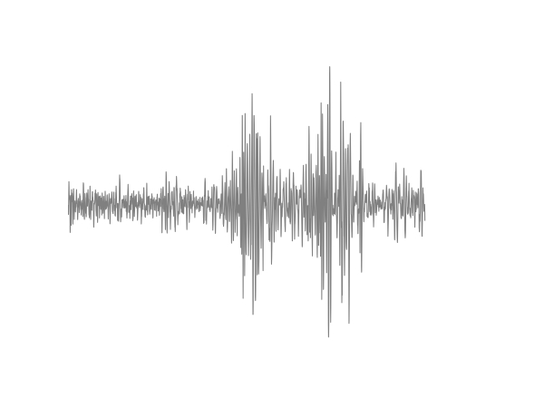
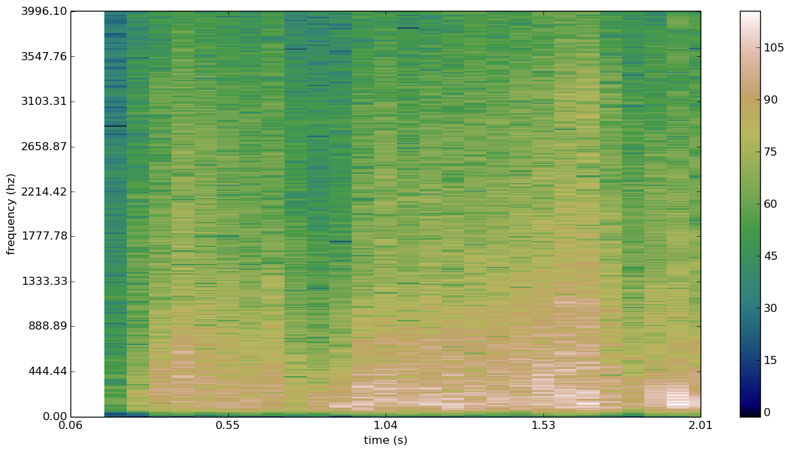

myCitySoundsViz
===============

A visualization of sound project: focussed on The Mission neighborhood of San Francisco. Audio recordings sampled with an Android phone, while walking between 16th and 23rd Streets on Mission and Valencia streets.


##Data Collection Method

1. use OSMtracker app  
2. transfer files to laptop with usb cable
3. run renameFiles.py on folder 
  -goes through the xml file for "track", finds audio files corresponding to gps positions, appends gps info to filename of corresponding audio file
4. run commandline call to ffmpeg to convert renamed .3gpp files to .wav formats
5. if needed, run trimName.py on the  wav files converted from .3gpp files to remove ".3gpp" from the file names


####CommandLine--->to convert 3gpp files (from Android) to wav files:
This code converts to .wav format, but still need to remove ".3gpp" from new file's name

```
#!/bin/bash
for file in *.3gpp
do
  ffmpeg -y -i $file -f wav "$file.wav"
  touch "$file.wav" -r $file
done
```


full instructions here: 
https://code.google.com/p/osmtracker-android/wiki/Reading3GPPFiles

ToDo: wrap this in a python script, to streamline data-conversion process


##Audio Visualizations

####Generating Waveforms from .wav Audio Files




+ .wav files must be in folder /waves with subfolders for each track

+ target folder is /waveforms 

+ run python script form command line: ProcessFolders.py, to generate subfolders for each track, and image files of wave forms

ToDo: extract general data from each audio file and save in aggregate format. functions are currently commented out of ProcossFile.py script. 


####Generating Spectrographs from .wav Audio Files



+ .wav files must be in folder /waves with subfolders for each track

+ target folder is /graphs 

+ run python script form command line: makeSpecGraph.py, to generate subfolders for each track, and image files of spectrographs

ToDo: improve resolution for printing and maybe trim resulting image to more artistic style


####D3 Interactive Visualization

Working on some experiments. ...